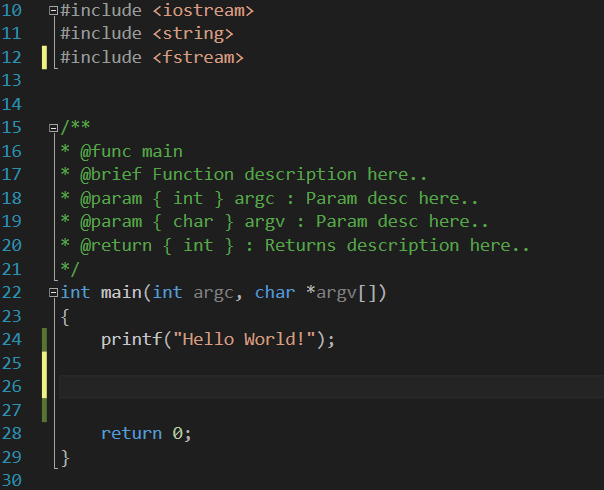

[](https://travis-ci.com/jcs-elpa/line-reminder)
[](https://melpa.org/#/line-reminder)
[](https://stable.melpa.org/#/line-reminder)
[](https://www.gnu.org/licenses/gpl-3.0)

# line-reminder
> Line annotation similar to Visual Studio.

| Line Reminder in Emacs Comparison      | Visual Studio Comparison            |
|:--------------------------------------:|:-----------------------------------:|
| | |

## Usage

Enable for all buffers.

```el
(global-line-reminder-mode t)
```

Or you can just enable in specific buffer you want.

```el
(line-reminder-mode t)
```

### Display Annotation

You can either set `line-reminder-show-option` to `linum` or `indicators`
like the following snippet below.

```el
(setq line-reminder-show-option 'linum)  ; Or set to 'indicators
```

### Using `linum` (Not recommended)

`linum` uses text to display annotation, you can customize the two variables
below to change the display symbol. The default value for both variables is set
to `"▐"`.

* `line-reminder-modified-sign`
* `line-reminder-saved-sign`

Customize string on the right/left side of the line number.

```el
(setq line-reminder-linum-left-string "")
(setq line-reminder-linum-right-string " ")
```

### Using `indicators` (Recommended)

*If you wish to use indicators to display annotation, make sure you install
[indicators](https://github.com/Fuco1/indicators.el) package.*

Customize the symbol of the fringe

```el
(setq line-indicators-fringe 'filled-rectangle)
```

If you change the fringe location by altering this variable.

```el
(setq line-indicators-fringe-placed 'left-fringe)
```

### Face

List of face you can customize.

* `line-reminder-modified-sign-face`
* `line-reminder-saved-sign-face`

## Contribution

If you would like to contribute to this project, you may either
clone and make pull requests to this repository. Or you can
clone the project and establish your own branch of this tool.
Any methods are welcome!
