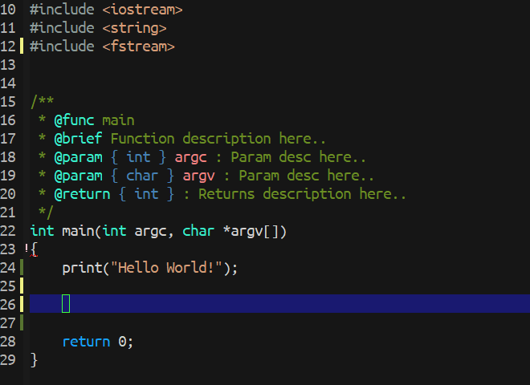

# line-reminder #

Remind current line status by current buffer.<br/><br/>


## Configuration ##
Customize the modified sign.
`(setq line-reminder-modified-sign "▐")`

Customize the saved sign.
`(setq line-reminder-saved-sign "▐")`

Customize string on the right/left side of the line number.
```
(setq line-reminder-linum-left-string "")
(setq line-reminder-linum-right-string "  ")
```

List of face you can customize.
* `line-reminder:modified-sign-face`
* `line-reminder:saved-sign-face`

Buffer Name List that you do not want this mode to take effect.
```
(setq line-reminder-ignore-buffer-names '("*Buffer List*"
                                          "*Checkdoc Status*"
                                          "*Echo Area 0*"
                                          "*helm "
                                          "magit"
                                          "*run*"
                                          "*shell*"
                                          "*undo-tree*"))
```


## Usage ##
Enable for all buffers.
```
(global-line-reminder-mode t)
```
Or you can just enable in specific buffer you want.
```
(line-reminder-mode t)
```

## Screenshot ##



## Contribution ##
If you would like to contribute to this project. You may either
clone and make pull request to this repository. Or you can
clone the project and make your own branch of this tool. Any
methods are welcome!
